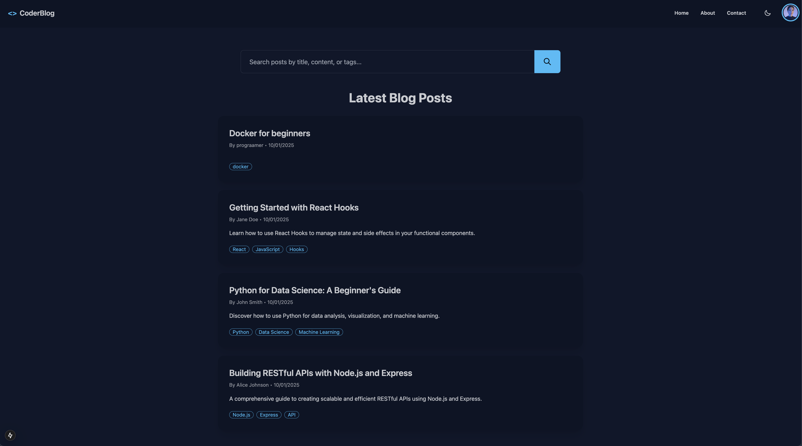
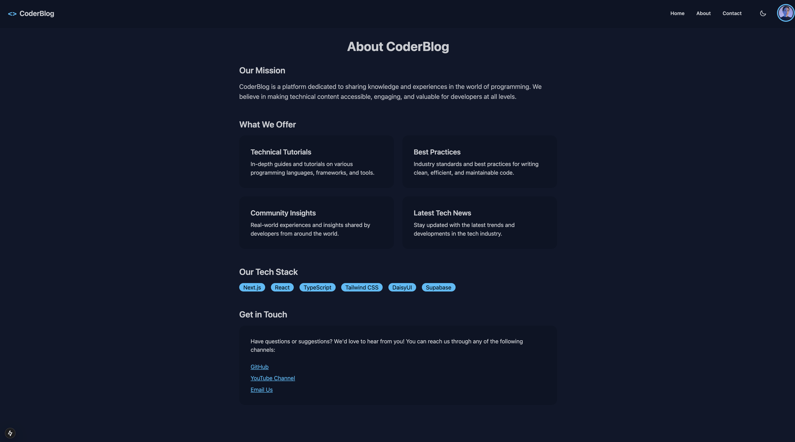
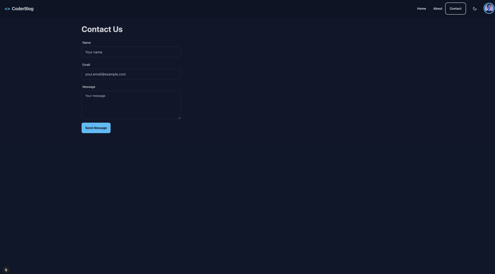

# CoderBlog

A modern blog platform for developers built with Next.js, Supabase, and DaisyUI.






## Features

### 🎨 UI/UX

- Modern, responsive design using DaisyUI components
- Dark/Light theme toggle with smooth transitions
- Responsive navigation bar with profile dropdown
- Dynamic search functionality for posts
- Beautiful card-based blog post layout

### 🔍 Search & Filtering

- Real-time search across posts
- Filter by title, content, and tags
- Instant search results
- Clean and intuitive search interface

### 🗃️ Data Management

- Supabase backend integration
- Posts table with:
  - Auto-incrementing IDs
  - Title, content, and excerpt fields
  - Author information
  - Tags support (array)
  - Published status
  - Timestamps for creation and updates
  - Unique slugs for SEO-friendly URLs

### 🛠️ Technical Stack

- **Frontend**: Next.js 14 with App Router
- **Styling**: Tailwind CSS with DaisyUI
- **Backend**: Supabase
- **Database**: PostgreSQL (via Supabase)
- **State Management**: React Hooks
- **TypeScript**: Full type safety

## Getting Started

1. Clone the repository:
    git clone https://github.com/aamersohailgit/blog-website-next.git
    cd blog-website-next
    npm install
    npm run dev

2. Set up environment variables:

    - Create a new file named `.env.local` in the root directory.
    - Add the following variables:
        - NEXT_PUBLIC_SUPABASE_URL=your_supabase_url
        - NEXT_PUBLIC_SUPABASE_ANON_KEY=your_supabase_anon_key


## Database Schema

- SQL

```
-- Create posts table
CREATE TABLE posts (
  id BIGINT GENERATED BY DEFAULT AS IDENTITY PRIMARY KEY,
  title VARCHAR(255) NOT NULL,
  content TEXT NOT NULL,
  excerpt TEXT,
  author VARCHAR(255),
  slug VARCHAR(255) UNIQUE NOT NULL,
  tags TEXT[] DEFAULT '{}',
  published_at TIMESTAMP WITH TIME ZONE DEFAULT CURRENT_TIMESTAMP,
  updated_at TIMESTAMP WITH TIME ZONE DEFAULT CURRENT_TIMESTAMP,
  is_published BOOLEAN DEFAULT false
);

-- Add some sample posts
INSERT INTO posts (title, content, excerpt, author, slug, tags, is_published)
VALUES
  (
    'Getting Started with React Hooks',
    'Learn how to use React Hooks to manage state and side effects in your functional components. This comprehensive guide covers useState, useEffect, and more...',
    'Learn how to use React Hooks to manage state and side effects in your functional components.',
    'Jane Doe',
    'getting-started-with-react-hooks',
    ARRAY['React', 'JavaScript', 'Hooks'],
    true
  ),
  (
    'Python for Data Science: A Beginner''s Guide',
    'Discover how to use Python for data analysis, visualization, and machine learning. We''ll cover pandas, numpy, scikit-learn and more...',
    'Discover how to use Python for data analysis, visualization, and machine learning.',
    'John Smith',
    'python-for-data-science',
    ARRAY['Python', 'Data Science', 'Machine Learning'],
    true
  ),
  (
    'Building RESTful APIs with Node.js and Express',
    'A comprehensive guide to creating scalable and efficient RESTful APIs using Node.js and Express. Learn about routing, middleware, and best practices...',
    'A comprehensive guide to creating scalable and efficient RESTful APIs using Node.js and Express.',
    'Alice Johnson',
    'building-restful-apis-nodejs',
    ARRAY['Node.js', 'Express', 'API'],
    true
  );

-- Enable Row Level Security (RLS)
ALTER TABLE posts ENABLE ROW LEVEL SECURITY;

-- Create policy to allow public read access for published posts
CREATE POLICY "Public posts are viewable by everyone" ON posts
  FOR SELECT
  USING (is_published = true);
  ```

## Author: Aamer Sohail
- YouTube Channel: [Prograamer](https://www.youtube.com/@prograamer)

